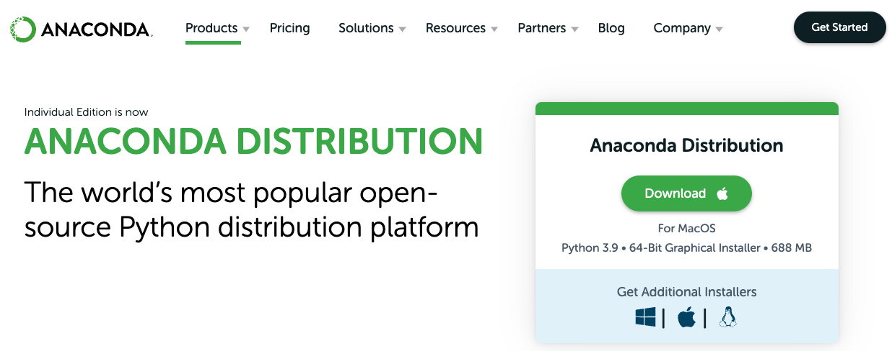
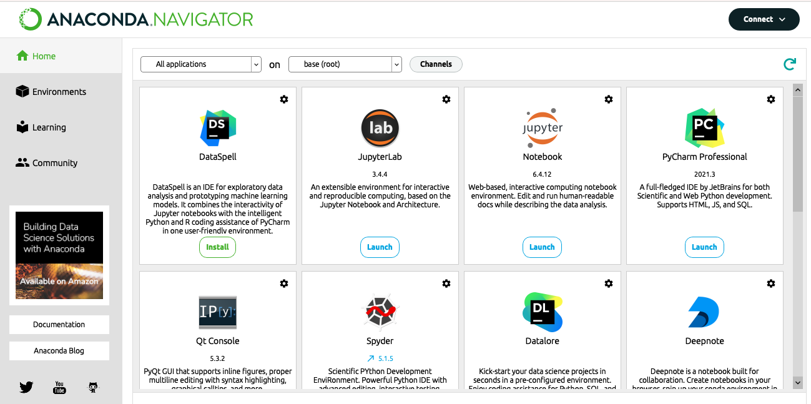
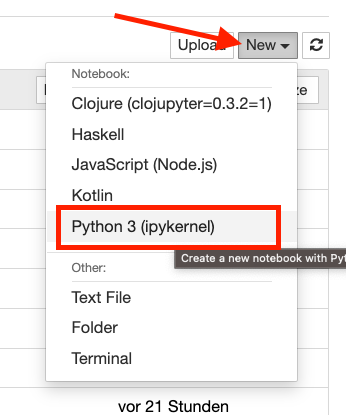
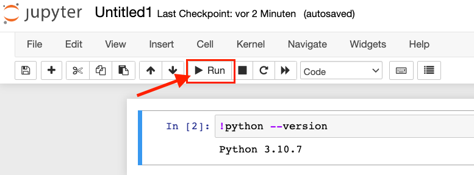
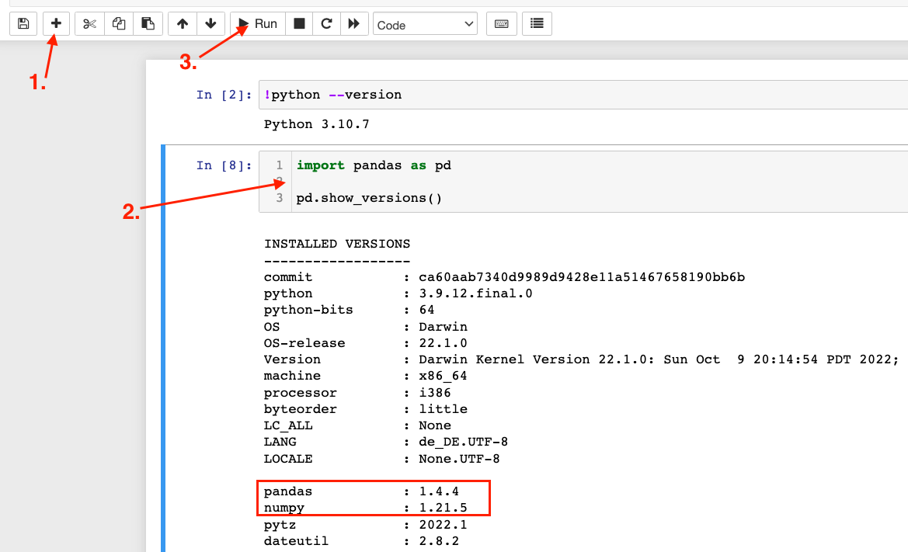

# Einführung in den Data Science Stack mit Python

Liebe Teilnehmer:innen.

In diesem zweiteiligen Kurs sollen die Python Module [Pandas](https://pandas.pydata.org/), [Matplotlib](https://matplotlib.org/), [NumPy](https://numpy.org/), [SciPy](https://scipy.org/) und weitere vorgestellt werden. Diese Module in Grundzügen zu kennen ist eine wichtige Vorraussetzung, möchten Sie Python in Ihrer täglichen wissenschaftlichen Arbeit verwenden. Der Kurs soll dazu dienen, Ihnen das nötige *Handwerkzeug* zu vermitteln, das nötig ist, Python für die Manipulation, Säuberung, (statistischen) Analyse und Visualisierung von Daten zu verwenden. Aufgrund der Kürze können wir natürlich nur die absoluten "Basics" betrachten, aber wollen dennoch einen Kenntnisstand am Ende erwerben, der befähigt, sich weitere Bereiche und Themen in diesem Umfeld zu erschließen.

## Installation der nötigen Tools

Was brauchen Sie für den Kurs? Nun zu allerst müssen Sie auf dem Rechner, auf dem Sie arbeiten wollen, Python und die nötigen, oben genannten, Bibliotheken installieren. Sehr einfach geht diese mit der Distribution [Anaconda](https://www.anaconda.com/download) die Python in der Version 3.10, sowie obige Pakete gleich mitinstalliert. Mit weiteren Tools zum Schreiben von Code, wie z.B. den Jupyter Notebooks haben Sie damit alles, was Sie brauchen und können so direkt starten.

Laden Sie sich dazu *Anaconda* von der [Seite des Herstellers](https://www.anaconda.com/products/distribution) für Ihr Betriebssystem herunter und installieren Sie dies.



Sobald die Installation abgeschlossen ist, können Sie den **Anaconda Navigator** starten. Dieser bietet Ihnen die Möglichkeit, mehrere Programme zum Bearbeiten von Python Code zu starten oder nachträglich zu installieren.



Wir werden aber vor allem mit dem Tool **Jupyter Notebooks** arbeiten. Um zu testen, ob die Installation erfolgreich war, starten Sie bitte Jupyter Notebooks. Es sollte sich nach kurzer Zeit ein neuer Tab in Ihrem Browser öffnen der Ihnen eine Ansicht des "Heimverzeichnisses" auf Ihrer Festplatte bietet. Erstellen Sie nun eine neues Notebook, indem Sie auf `New/Neu` klicken und wählen Sie `Python 3 (ipykernel)`.



Geben Sie nun in die erste Zeile `!python --version` ein und drücken Sie auf "Run". Ist alles richtig installiert sollte hier eine Python Version angezeigt werden.



Sie könnten jetzt nur noch testen, ob auch die wichtigsten der oben genannten Module mitinstalliert wurden. Drücken Sie dazu auf das "Plus-Zeichen", um eine neue *Zelle* zu erstellen; kopieren Sie nachfolgenden Code und drücken Sie wieder auf "Run".

``` python
import pandas as pd

pd.show_versions()
```



Hier sollten zumindest die Module `NumPy`, `Pandas` und `Matplotlib` auftauchen.

**So dann haben Sie es geschafft - Sie sind bereit für den Kurs! Das war schon alles! ;-)**

## Empfehlung (optional!)

Zur besseren Navigation innerhalb der Notebook Dateien empfiehlt es sich die Ansicht eines *Inhaltsverzeichnisses* als Jupyter-Notebook Erweiterung zu installieren.

Dies ist leicht über das Kommandozeilenwerkzeug `conda` zu bewerkstelligen.

- Schlieẞen Sie einen eventuell laufenden Jupyter Server.
- Öffnen Sie ein Terminal und geben folgenden Befehl ein: `conda install -c conda-forge jupyter_contrib_nbextensions`.
- Danach starten Sie Jupyter über den Anaconda-Navigator erneut.
- Im darauf sich öffnenden Tab Ihres Browsers gibt es nun einen neuen "Unter-Tab" mit Namen *Nbextensions*.
- Dort aktivieren Sie die Checkbox bei *Table of Contents (2)*.
- Beenden Sie und starten Sie Jupyter erneut.
- Nun können Sie sich bei einem laufenden Notebook über einen neuen Button das Inhaltsverzeichnis anzeigen lassen.
- Weitere Infos dazu finden Sie [hier](https://jupyter-contrib-nbextensions.readthedocs.io/en/latest/nbextensions/toc2/README.html).

## Einstieg in den Kurs

Die zwei Teile des Kurses finden Sie im Ordner **analysis**.